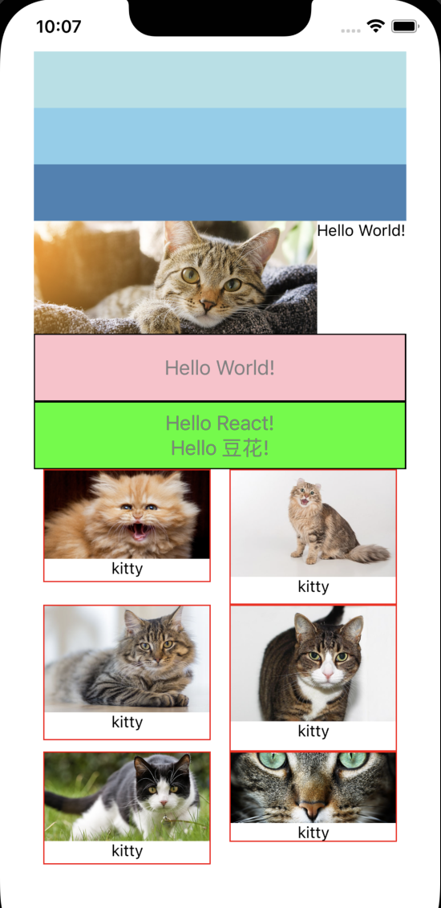

# 使用样式表 stylesheet

<p>

</p>

## 组件的样式

组件样式 = 通用样式 + “私有”样式


## eslint issue

```
Inline style: xxxx eslint(react-native/no-inline-styles)
```

to fix, disable the rule `no-inline-styles` in the file [.eslintrc.js](../../.eslintrc.js)

```javascript
rules: {
  'react-native/no-inline-styles': 'off',
}
```
