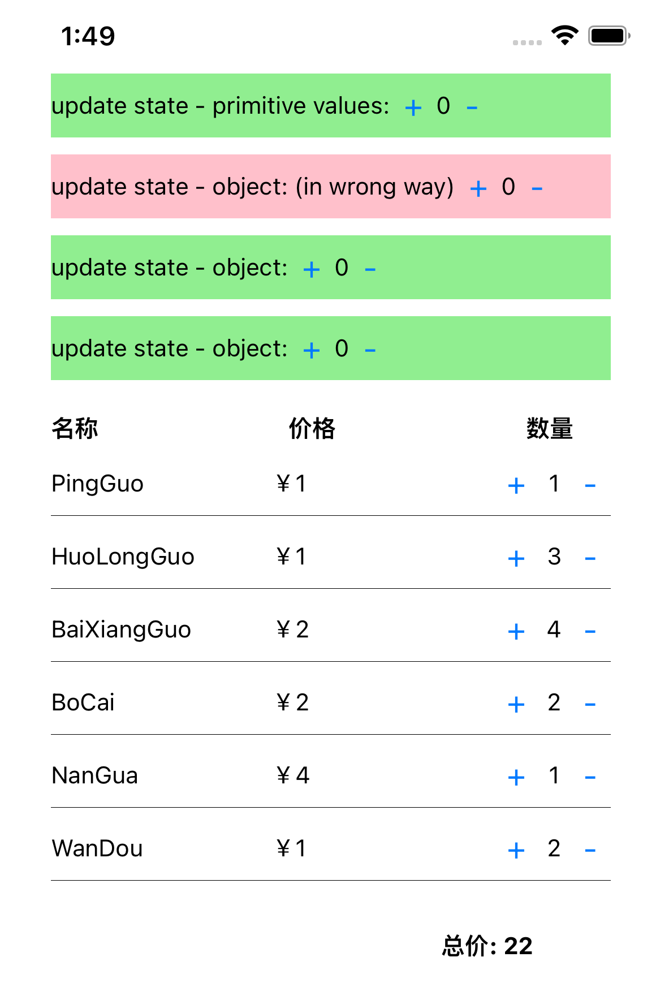

# State：如何让页面“动”起来？

<p>

</p>

## 步骤

- 状态初选 —— 先选出会“动”的数据来

  看看页面哪些数据是会变化的，这些会变化的数据都可能是状态，我们先把它们找出来。从下面两个方向来进行初选。
  1. 程序本身的事件，比如网络请求、 setTimeout，都可能导致页面发生变化。
     - 比如网络请求
     - 第一条动态数据是请求过程
     - 第二条是可能的请求失败情况
     - 第三条是请求数据本身
     - 第四条是根据请求返回数据的计算状态
  2. 用户操作，比如点击、滑动、缩放，也可能导致页面发生变化。

- 状态确定 —— 合并同类状态、删除无用状态

  状态初选完成后，不急着写代码，要先确定一下这些初选状态中哪些是真正的状态，把其中无用的状态剔除掉，然后再去写代码。
  
  以下是经验分享：
  - 一件事情一个状态
  
    一个常见的错误示例：在定义请求状态时，用布尔值 isLoading 来表示空闲状态或请求中的状态，用 isError 来表示成功状  态或失败状态，明明就是网络请求这一件事，却用了两个状态来表示，这就有点多余了。
  
  - 重复状态不是状态
  
    比如，把两个在不同组件之间的重复状态进行合并，去掉底层组件的重复状态，只保留顶层组件中的，作为唯一的状态。
  
  - 可计算出来的状态不是状态
  
    一个状态必须不能通过其他状态、属性或变量直接计算出来，能通过其他值计算出来的状态，都不是状态。

- 状态声明

  在定义状态的时，一定要先考虑好把状态绑定到哪个组件上，建议使用就近原则来绑定状态。所谓就近原则就是哪个组件用上了状态，就优先考虑将状态绑定到该组件上，如果有多个组件使用了同一个状态，则将其绑定到最近的父组件上。这样做可以尽可能减少 props 传递状态的次数。

- 状态更新

  状态可以是原始值类型，也可以是对象类型。更新这两种类数据类型的状态的方法不一样，如果没有理解清楚二者的区别，就容易出现一些低级的 BUG。
  
  对于原始值类型而言，调用 setXXX 更新原始值类型状态的值，页面就会发生更新。
  
  对象是一种复合数据类型，它内部的值是可变的（mutable），但它的引用是不可变了（immutable）。如果只更新了对象的内部值但它的引用并没有发生变化，页面是不会更新的。

## mock api

https://6250e1d0e3e5d24b3427ff30.mockapi.io/api/v1/products

## lint

- 添加了 eslint for hooks `eslint-plugin-react-hooks`
- 自动修复 lint 错误

  ```shell
  npm run lint:fix
  ```

## to resolve some problems

1. 
```
error  Parsing error: Unexpected token <
```

please refer to [here](https://lifesaver.codes/answer/error-parsing-error-unexpected-token)

2. 
```
Error: Rendered fewer hooks than expected. This may be caused by an accidental early return statement.
```
这是因为违反了 react-hooks 规则。

- 和普通函数不同，不能把钩子函数写在 if 条件判断中、事件循环中、嵌套的函数中，这些都会导致报错。

- 钩子函数类似于 JavaScript 的 import ，最好在函数组件的顶部使用它们。

在 React 的 Hook 机制中，是把 Hook 的调用顺序作为索引，用它把 React 框架内部 state 和其函数组件的 useState 返回值中的 state 给关联起来了。当使用 if 的时候，就容易破坏 Hook 的调用顺序，导致 React 不能正确地将框架内部 state 与函数组件 useState 的返回值关联起来，因此 React 在执行的时候就会报错。

**经验：**

应该把 use 开头的钩子函数都写在组件的顶部，把 JSX 都写在函数组件的最后面，并使用 `eslint-plugin-react-hooks` 插件来保障 Hook 规则的会被正确执行。

## reference

- [Hook 规则](https://zh-hans.reactjs.org/docs/hooks-rules.html)
- [React 哲学](https://zh-hans.reactjs.org/docs/thinking-in-react.html)
