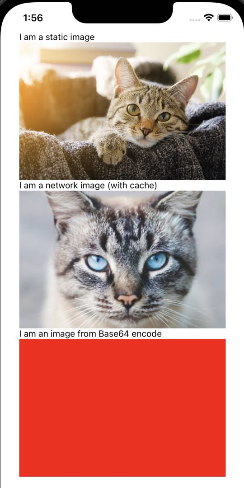

# Image：图片加载方式

<p>

</p>

## 静态图片

注意这里 require 函数的入参必须是 **字面常量**，而不能是变量。

```jsx
// 方案一：正确
const cat = require('../res/cat_cute.jpeg');
<Image source={cat} />

// 方案二：错误
const path = '../res/cat_cute.jpeg'
const cat = require(path)
<Image source={cat}/>
```

静态图片的加载原理

- 第一步“编译时”，生成了图片注册函数和其注册的信息

```shell
npx react-native bundle --entry-file index.js --dev false --minify false --bundle-output ./build/index.bundle --assets-dest ./build
#
# build
# ├── assets
# │   └── src
# │       └── res
# │           └── cat_cute.jpeg
# └── index.bundle
```

- 第二步“构建时”，将真正图片内到了 App 中

```shell
npx react-native run-ios --configuration Release
```

- 第三步“运行时”，拿到这些图片信息，并加载和展示真正的内置图片

在运行时，require 引入的并不是静态图片资源本身，而是静态图片资源的信息。

## 网络图片

在使用网络图片时，需要将宽高属性作为一个必填项来处理。为什么呢？和前面介绍的静态图片资源不同的是，网络图片下载下来之前，React Native 是没法知道图片的宽高的，所以它只能用默认的 0 作为宽高。如果我们没有填写宽高属性，初始化默认宽高是 0，网络图片就展示不了。

```javascript
<Image style={{width: 400, height: 400}} source={{uri: uri}} />
```

网络图片需要考虑使用缓存加速图片加载，提升用户体验。
Android 和 iOS 使用不同的图片加载组件作为缓存机制。

使用图片预加载机制，可以提前把网络图片缓存到本地。

```javascript
Image.prefetch(url);
```

## 宿主应用图片

参考各平台信息。

在实际工作中，不推荐在 React Native 中使用宿主应用图片资源。
- 这种加载图片的方法没有任何的安全检查，一不小心就容易引起线上报错
- 无法使用 React Native 动态更新的优势

## Base64 图片

Base64 指的是一种基于 64 个可见字符表示二进制数据的方式。

Base64 图片指的是使用 Base64 编码加载图片的方法，它适用于那些图片体积小的场景。

**即便是相同的图片，Base64 字符串的体积也要比二进制字节码的体积要大 1/3，这又进一步增加 Bundle 的大小。**

```jsx
<Image
  source={{
    uri: 'data:image/gif;base64,R0lGODdhAQABAPAAAP8AAAAAACwAAAAAAQABAAACAkQBADs='
  }}
/>
```

[Image to Base64](https://base64.guru/converter/encode/image)

## 最佳实践

TBD
