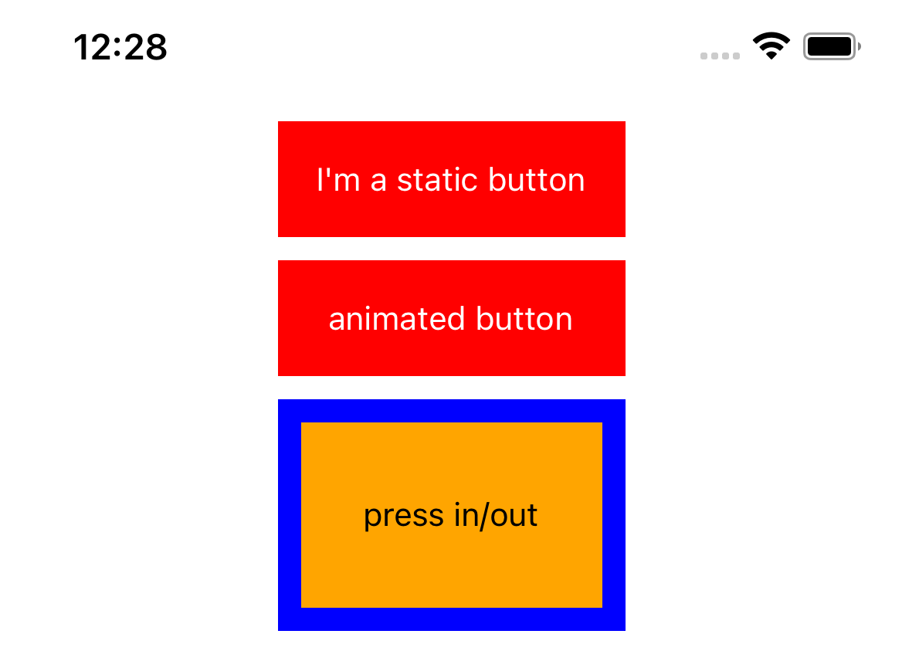

# Pressable： 按钮的选择

<p>

</p>

经历了三次迭代的点按控件，从 touchable 到对 touchable 封装的原生平台风格的点按组件，再到新一代的反馈效果可由开发者自行配置的 pressable 点按组件。

## 如何选择

- 第一代 Touchable ，功能丰富但学习成本太高；
- 第二代 Button ，简单易用但带了默认样式和反馈效果，通用性太差；
- 第三代 Pressable ，同时满足了简单易用和复杂效果可扩展的特性。

因此，在实现自定义的业务按钮组件时，我更加推荐你使用第三代点按组件 Pressable 。

## 组件的事件

四种基础点按事件， onPressIn 、 onPressOut 、 onPress 、 onLongPress 。
其中，点击事件 onPress 和长按事件 onLongPress 是互斥的，触发了一个就不会再触发另一个了。

判断 onPressIn 事件和 onPressOut 事件之间触发间隔耗时就可以确定是 点击 还是 长按（间隔>500ms）。

### 盒模型区域 box-model

先看看 W3C 规范的盒模型


Content 、 Padding 、 Border 默认是不透明度的，但 Margin 是天生透明的，并且不可以设置透明度及颜色。

### 可视区域 VisualRect

RN 的组件也是参考 W3C 的盒模型。点按事件的默认触发区域是盒模型中的默认不透明的部分。这些用户看得见的部分，包括 content、padding 和 border 部分。可以看得见才可以点击，这样的设计是非常合理的。

### 可触发区域 HitRect

HitRect 就是盒模型中的不透明的可见区域。你可以通过修改 hitSlop 的值，直接扩大可触发区域。

### 可保留区域 PressRect

通过设置 pressRetentionOffset 属性，来扩大可保留区域 PressRect。


可以反悔？哈哈，把已经按下的手指从可保留区域挪开，然后再松手，就不会再继续触发点击事件了。

### pressable 的实现细节

```
 * `Pressability` only assumes that there exists a `HitRect` node. The `PressRect`
 * is an abstract box that is extended beyond the `HitRect`.
 *
 * # Geometry
 *
 *  ┌────────────────────────┐
 *  │  ┌──────────────────┐  │ - Presses start anywhere within `HitRect`, which
 *  │  │  ┌────────────┐  │  │   is expanded via the prop `hitSlop`.
 *  │  │  │ VisualRect │  │  │
 *  │  │  └────────────┘  │  │ - When pressed down for sufficient amount of time
 *  │  │    HitRect       │  │   before letting up, `VisualRect` activates for
 *  │  └──────────────────┘  │   as long as the press stays within `PressRect`.
 *  │       PressRect    o   │
 *  └────────────────────│───┘
 *          Out Region   └────── `PressRect`, which is expanded via the prop
 *                               `pressRectOffset`, allows presses to move
 *                               beyond `HitRect` while maintaining activation
 *                               and being eligible for a "press".

 * # State Machine
 *
 * ┌───────────────┐ ◀──── RESPONDER_RELEASE
 * │ NOT_RESPONDER │
 * └───┬───────────┘ ◀──── RESPONDER_TERMINATED
 *     │
 *     │ RESPONDER_GRANT (HitRect)
 *     │
 *     ▼
 * ┌─────────────────────┐          ┌───────────────────┐              ┌───────────────────┐
 * │ RESPONDER_INACTIVE_ │  DELAY   │ RESPONDER_ACTIVE_ │  T + DELAY   │ RESPONDER_ACTIVE_ │
 * │ PRESS_IN            ├────────▶ │ PRESS_IN          ├────────────▶ │ LONG_PRESS_IN     │
 * └─┬───────────────────┘          └─┬─────────────────┘              └─┬─────────────────┘
 *   │           ▲                    │           ▲                      │           ▲
 *   │LEAVE_     │                    │LEAVE_     │                      │LEAVE_     │
 *   │PRESS_RECT │ENTER_              │PRESS_RECT │ENTER_                │PRESS_RECT │ENTER_
 *   │           │PRESS_RECT          │           │PRESS_RECT            │           │PRESS_RECT
 *   ▼           │                    ▼           │                      ▼           │
 * ┌─────────────┴───────┐          ┌─────────────┴─────┐              ┌─────────────┴─────┐
 * │ RESPONDER_INACTIVE_ │  DELAY   │ RESPONDER_ACTIVE_ │              │ RESPONDER_ACTIVE_ │
 * │ PRESS_OUT           ├────────▶ │ PRESS_OUT         │              │ LONG_PRESS_OUT    │
 * └─────────────────────┘          └───────────────────┘              └───────────────────┘
 *
 * T + DELAY => LONG_PRESS_DELAY + DELAY
```

## 参考

- [Pressable](https://reactnative.dev/docs/pressable)
- [source code of Pressability](https://github.com/facebook/react-native/blob/main/Libraries/Pressability/Pressability.js)
