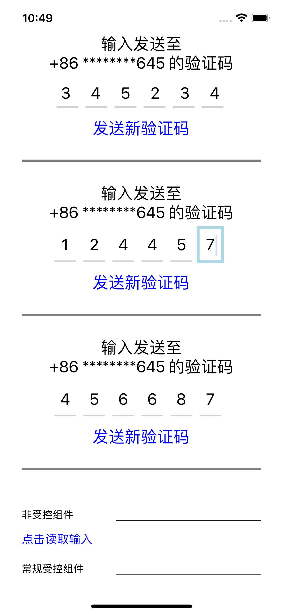

# TextInput：输入框

<p>

</p>

TextInput 组件是自带状态的宿主组件 
（什么是自带状态？）

## 输入的内容

TextInput 组件和键盘是联动的，在处理好 TextInput 组件的同时，还得关心一下键盘。

### 非受控（Uncontrolled）组件

非受控的意思就是不使用 state，直接对从宿主组件上将文本的值同步到 JavaScript。

对于非受控组件来说，存储跨越两次 render 的可行方案是 ref。ref 的值不会因为组件刷新而重新声明，它是专门用来存储组件级别的信息的。

在 React 里 ref 用于：
- 存储 setTimeout/setInterval 的 ID；
- 存储和操作宿主组件（在 Web 中是 DOM 元素）；
- 存储其他不会参与 JSX 计算的对象。
>[参考](https://beta.reactjs.org/learn/referencing-values-with-refs#when-to-use-refs)

### 受控（Controlled）组件

受控的意思说的是使用 JavaScript 中的 state 去控制宿主组件中的值。

对于受控组件来说，分为用户输入文字和文字展示这两步，也就是受控组件更新了两次展示的值，但因为两次展示的值是一样的，用户看不出来而已。

可以更加自由地控制输入的文本。

对更新两次有性能上的担忧？可以使用异步事件。

我的建议就是使用受控组件，并且使用异步的文字改变事件，这也符合大部分人的代码习惯。

## 输入框的焦点

实现自动“对焦”

```jsx
<TextInput autoFocus/>
```
>当一个页面有多个输入框时，autoFocus 就没法实现焦点的转移了。

或者通过 .focus() 设置焦点

```javascript
const ref1 = useRef<TextInput>(null);

useEffect(() => {
  ref1.current?.focus();
}, []);
```

提交时自动设置焦点到下一个输入框，监听点击键盘完成按钮的提交事件 onSubmitEditing，在 onSubmitEditing 的回调中，将焦点通过 focus() 转移到下一个 TextInput 元素上。

```jsx
<TextInput
    ref={ref1}
    style={Styles.input}
    onSubmitEditing={() => ref2.current?.focus()}
    textContentType="name"
    returnKeyType="next"
/>
```

## 联动键盘

- 控制键盘右下角按钮置灰置蓝

  这是 iOS 独有的属性，通过 TextInput 的 enablesReturnKeyAutomatically 属性设置，默认是 false，也就是任何使用键盘右下角的按钮，都可以点击。你也可以通过将其设置为 true，使其在输入框中没有文字时置灰。

- 键盘右下角按钮的文案是可以根据不同的业务场景进行设置

  有两个属性可以设置这些文案，包括 iOS/Android 通用的 returnKeyType 和 Android   独有的 returnKeyLabel。
  一些通用属性：
  - default：显示的文案是换行；
  - done：显示的文案是“完成”，它适合作为最后一个输入框的提示文案；
  - go：显示的文案是“前往”，它适合作为浏览器网站输入框或页面跳出的提示文案；
  - next：显示的文案是“下一项”，它适合作为转移焦点的提示文案；
  - search：显示的文案是“搜索”，它适合作为搜索框的提示文案；
  - send：显示的文案是“发送”，它比较适合聊天输入框的提示文案。
  >[参考](https://reactnative.dev/docs/next/textinput#returnkeytype)

- 自动填写账号密码功能

  完成快速填写功能的 TextInput 属性，在 iOS 上叫做 textContentType，在 Android 上叫做 autoComplete。

  在登录页面，将账号输入框的快速填写属性设置 为username，将密码输入框的快速填写属性设置为 password，可以提高输入效率。

- 键盘类型

  keyboardType 可以控制键盘类型，可以让用户更方便地输入电话号码 phone-pad、邮箱地址 email-address 等等。
