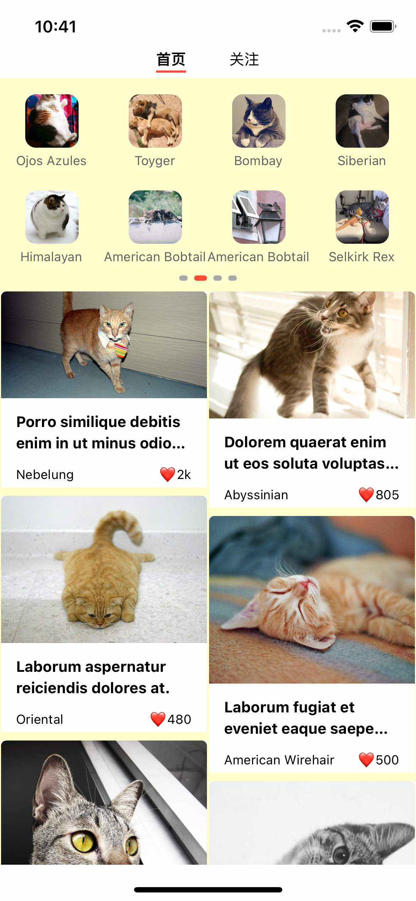
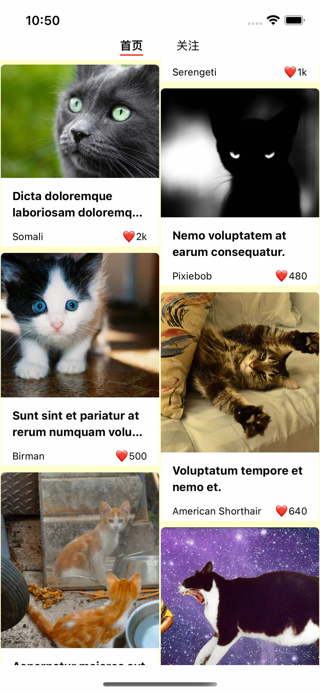
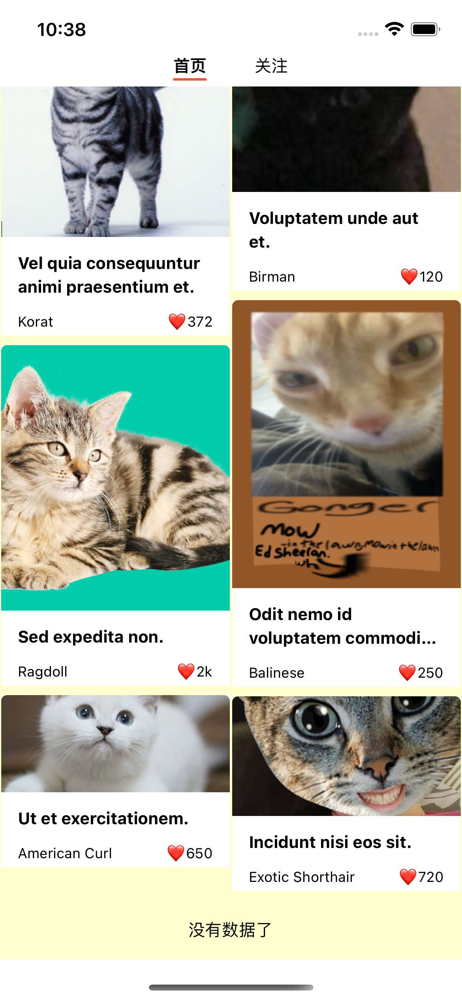

# 实战

NFT 商城首页，高大上的 NFT (non-fungible token) 不可代替币。就理解成卖**唯一、专属的图片资源**吧。

<p>



</p>

## 搭建项目

### 通用项目结构

```
.
├── apis: 应用级别的共享
├── components: 应用级别的共享
├── packages: 项目级别的共享
├── utils: 应用级别的共享
├── features: 套娃的过程。放业务组件和其后端接口数据的处理逻辑，它们的特点是经常变动而且关联性很强
├── screen: 页面级别的共享
│    ├── Home
│    │    ├── api
│    │    ├── components
│    │    └── ...
│    └── Follow
└── index.tsx
```

>这部分需要补充

项目级别的共享：可以参考业内的 monorepo 实践

## 拆分页面

完全不了解 mobile app，不得不学习一下页面的组成部件。
参考了一下 [Material Design](https://material.io/components)

TBD

## 分解组件

- 拆分组件原则是单一职责原则，一个组件只做一件事。
- 组件的状态根据就近原则进行放置，应该先考虑放在该组件上，再去考虑父组件。

## mock API

1. 自己创建 mock API

   这个是我们的老朋友了 https://mockapi.io

2. 使用公开的测试 API

   目前找到的两个较好用的免费 API 是

   - [dogs](https://dog.ceo/dog-api/documentation/)
   - [cats](https://docs.thecatapi.com/)
   
      例如，获取公开的宠物猫图片 https://api.thecatapi.com/v1/images/search?limit=5&page=1&order=desc

3. 辅助 [faker-js](https://fakerjs.dev/guide/)


>**知识本身不重要，要把知识内化成自己的能力才重要。只有以前真正思考过、实践过才能在遇到类似问题时，遇到更好解决方案时，快速学习、决策和解决。**

## 参考

- [Infinite Queries @React-Query](https://react-query.tanstack.com/guides/infinite-queries)
- [An efficient way to structure React Native projects](https://cheesecakelabs.com/blog/efficient-way-structure-react-native-projects/)
- [UI Design Works for Inspiration](https://uxplanet.org/top-ui-ux-design-inspiration-2fb59111a784)
