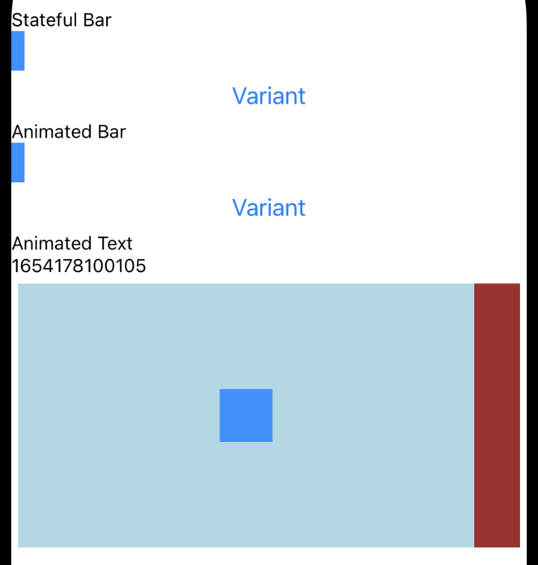

# Reanimated 动画

Reanimated ： React Native’s Animated library reimplemented.

<p>

</p>

## 动画的基本原理

看动画时，我们的眼睛接收到的是一张张并不连续的静态图片，但我们的大脑把这些不连续的图片“想象”成了一系列连续事件，这就是动画的基本原理。

而手机动画要想流畅，一般而言需要保证每 1 秒渲染 60 帧的速度。这里的每一帧都是一张静态图片，也就是说 1 秒钟需要渲染出 60 个静态图片。这也意味着手机处理每一帧的耗时，需要保证在 16.6ms（=1000/60）以内，如果处理一帧的耗时超过 16.6ms ，就会掉帧。掉帧多了 => 不连续感 => 卡顿 。

## 动画库

RN 中常用的三种动画工具，
- RN 自带的、适合轻量级动画场景的 Animated 动画；
- 适合无交互场景的、UI 设计师可以自动生成的 Lottie 动画；
- 适用于可交互场景的 Reanimated 动画。

## Reanimated 动画库

State 和 Reanimated 对比着学习


### 1. 共享值 SharedValue

- State

```jsx
import { useState } from 'react';

const [randomWidth, setRandomWidth] = useState(10);
```

- Reanimated

```jsx
import { useSharedValue} from 'react-native-reanimated';

const randomWidth = useSharedValue(10);
```

### 2. 衍生值 DerivedValue


- State

```jsx
const style = {
  width: randomWidth
}
```

- Reanimated

```jsx
import { useAnimatedStyle } from 'react-native-reanimated';

const style = useAnimatedStyle(() => {
  return {
    width: randomWidth.value,
  };
});
```

### 3. 动画组件 AnimatedComponent

- State

```jsx
import { View } from 'react-native';

<View style={[{ width: 100}, style]} />
```

- Reanimated

```jsx
import Animated from 'react-native-reanimated';

<Animated.View style={[{ width: 100}, style]} />
```

### 4. 更新共享值

- State

```jsx
const [randomWidth, setRandomWidth] = useState(10);
setRandomWidth(Math.random() * 350)
```

- Reanimated

```jsx
const randomWidth = useSharedValue(10);

// 1) 不带动画的更新
randomWidth.value = Math.random() * 350;

// 2) 启动基于时间的动画曲线，其默认的持续时间是 300ms
randomWidth.value = withTiming(Math.random() * 350);
```

## 深入 Reanimated 原理

### 当前动画可能存在的性能问题

React Native 有两个常用的线程：一个是 React Native 的 JavaScript 线程，另一个是 UI 主线程。

- JavaScript 线程和 UI 主线程是异步通信的，由 JavaScript 线程发起动画的执行，UI 线程并不能同步地收到该命令并且立刻执行，UI 线程至少要处理完成当前一帧的渲染任务后，才会执行 JavaScript 线程的动画命令。也就是说异步通讯会导致动画至少延迟 1 帧。

- JavaScript 线程处理的事件很多，包括所有的业务逻辑、React Diff、事件响应等等，容易抢占动画的执行资源。（可能发生掉帧，甚至感受到卡顿。）

对于 RN 自带的 Animated 动画库，开发者有个开启 UI 主线程执行动画任务的开关 `useNativeDriver` ，当开发者开启了这个开关后，动画就是在 UI 主线程执行了。

## Reanimated 怎么解决性能问题

Reanimated 动画库采用了另一种思路，把动画相关的 JavaScript 函数及其上下文传给了 UI 主线程。同时， Reanimated 又创建了一个 JavaScript 虚拟机来运行传过来的 JavaScript 函数。

换句话说，
在使用 Reanimated 之前，RN 只会在 JavaScript 线程创建一个 JavaScript 虚拟机，来运行 JavaScript 代码。
而使用 Reanimated 之后，Reanimated 会在 UI 主线程中创建另一个 JavaScript 虚拟机来运行动画部分相关的代码。


(Reanimated 的原理图)

代码比较

```jsx
const randomWidth = useSharedValue(10);
const style = useAnimatedStyle(()=>({width: randomWidth.value});

// 运行在 JS 线程的点击事件
const handlePress = () => {
  randomWidth.value = Math.random() * 350;
}
```

```jsx
// 运行 UI 线程的点击事件
const handleAnimatedPress = useAnimatedGestureHandler({
    onEnd: (_) => {
      randomWidth.value = Math.random() * 350;
    },
})
```

**一句话总结：Reanimated 动画性能好在于，在 Reanimated 真正执行动画的是 UI 线程中独立的 JavaScript 虚拟机。**

## 最佳实践

把动画代码放到 UI 主线程来执行性能会更好，动画不容易卡顿。

## 参考

- [reanimated installation](https://docs.swmansion.com/react-native-reanimated/docs/fundamentals/installation)
