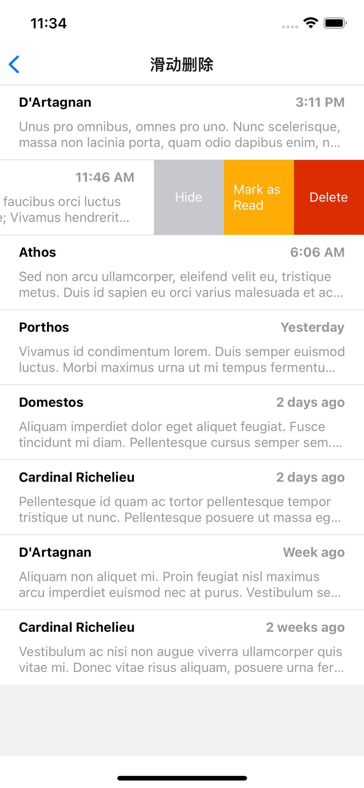

# 手势 Gesture

<p>



</p>

Gesture 组件 `react-native-gesture-handler`

>Gesture Handler aims to replace React Native's built in touch system called [Gesture Responder System](http://facebook.github.io/react-native/docs/gesture-responder-system).

## 手势基础

了解手势的基本原理，以 Pressable 点按事件为例，组件响应的整体流程：

>是硬件和软件相互配合的过程。  
>从触摸屏识别物理手势开始，到系统和框架 Native 部分把物理手势转换为 JavaScript 手势事件；
>再到框架 JavaScript 部分确定响应手势的组件；
>最后到 Pressable 组件确定是点击还是长按。

这里的框架的 JavaScript 部分指的就是 RN 自带的 [PanResponder](https://www.react-native.cn/docs/panresponder) 手势系统。

## Gesture 手势组件

### 人机交互的 4 步流程


1. Gesture 手势库收到系统手势事件；
1. Gesture 手势库确定需要响应哪些组件；
1. Gesture 手势库触发相关手势回调函数；
1. 通过 Gesture 回调函数返回 event 参数，使用回调返回值 event 可以更新共享值或状态，执行动画或渲染。

**下面介绍 9 种手势事件、10 种回调函数、两类回调参数。**

### 支持的手势

Gesture 支持的 1 + 8 手势 —— 1 个最底层原始手势 Manual ，以及 8 个封装好的上层手势。


### 手势回调类型

- 第一类是通用回调
   - onBegin
   - onTouchesDown
   - onTouchesMove
   - onTouchesUp
   - onFinalize

  无论哪种手势都会有以上回调，只要用户和相关视图发生了交互行为，即便该手势并未真正触发，但也会触发相关的通用回调。

- 第二类是激活（ACTIVE）回调
   - onStart
   - onUpdate
   - onChange
   - onEnd

- 第三类是系统取消回调，它是一个特例 onTouchesCancelled

  当触发 onTouchesCancelled 回调时，通常是操作系统把手势打断了。

>NOTE  
>**即便手势触发成功，但当手势结束时不一定会调用 onEnd 回调，因为还有 onTouchesCancelled 回调这种情况。因此，如果想保证无论发生什么情况都有结束回调，应该使用 onFinalize 回调代替 onEnd 回调。**

### 手势回调返回参数

常用类回调参数：


场景类回调参数：


### Gesture 的使用

Gesture 手势库真正厉害的地方，在于能和 Reanimated 动画库配合使用，二者结合，能实现各种丰富的手势动画。

**在学习 Gesture 手势库的时候，要注意区分 UI 线程和 JavaScript 线程。**
- Gesture 在**声明和初始化过程是运行在 JavaScript 线程中的**，但声明之后的**手势回调函数的执行都是默认运行在 UI 线程的**。
- Gesture 手势库和 Reanimated 动画库搭配使用时，Gesture 的手势回调函数是在 Reanimated 动画库创建的 UI 线程的 JavaScript 虚拟机中执行的。手势动画的全过程都可以运行在 UI 线程，不受 JavaScript 线程性能瓶颈的约束。

参考 [官方快速开始](https://docs.swmansion.com/react-native-gesture-handler/docs/installation)

```tsx
const singleTap = Gesture.Tap().onStart(() => {
  console.debug('start to tap');
});

<GestureHandlerRootView style={styles.container}>
  <GestureDetector gesture={singleTap}>
    <View style={styles.rectangle} />
  </GestureDetector>
</GestureHandlerRootView>
```

>解释：  
>使用根组件 `GestureHandlerRootView` 包裹 `GestureDetector` ，设置组件 GestureDetector 的 `gesture` 属性。  
>\* GestureDetector 组件并不会真正渲染到屏幕上，只是用于绑定手势到视图。

#### 单击/拍手势

参考 [代码](./basic/tap.tsx)

#### 拖拽手势

实现一个拖拽动画主要分为三步：
1. 创建 Gesture.Pan 手势并将拖拽手势绑定到动画组件上；
2. 在 Gesture.Pan 拖拽手势的 10 个手势回调中，选择 onBegin 和 onFinalize 手势回调响应拖拽开始和拖拽完成，选择 onChange 响应拖拽移动；
3. 在相应的拖拽回调中同步更新动画组件的共享值，也就是 x、y 轴坐标，实现基础的拖拽动效。

拖拽手势的 10 个回调，如下依次触发：
- onBegin ：开始识别到手势，此时拖拽并未发生。也就是说，这时手指是触碰到 View 视图，手指还未移动；
- onTouchesDown ：手指按下触摸到视图时触发。可以理解为在手指触摸到视图时，先触发了 onBegin ，紧接着就触发了 onTouchesDown；
- onTouchesMove ：手指移动后触发；
- onStart ：当手指移动距离超过 Float.MIN_VALUE 的阈值时(也就是精度为 0.000000 的距离时)，触发该回调，此时拖拽事件正式触发；
  >手指触碰和离开视图时是不会触发 onStart 和 onEnd 回调的
- onUpdate ：在手指移动的过程中，会更新 x/y 坐标等参数，参数更新后 onUpdate 回调就会触发；
- onChange ：在手指移动的过程中，紧接着 onUpdate 触发。onChange 和 onUpdate 的区别是，坐标参考不同：
  - onChange 的参数是以上一次回调的参数作为基准进行更新的；
  - onUpdate 是以手势触发 onStart 时的参数为基准进行更新的。
- onTouchesUp ：当手指离开屏幕时触发，与 onTouchesDown 是成对的；
- onEnd ：当手指离开屏幕时，先触发 onTouchesUp 回调，紧接着触发 onEnd 回调，与 onStart 是成对的；
- onTouchesCancelled ：较为少见，一般是在系统弹窗等中断手势的情况下触发；
- onFinalize ：只要手势结束，最终都会触发。

参考 [代码](./basic/drag.tsx)

## 手势冲突

### 捕获冒泡机制

框架收到了用户的一个点击手势，视图是否需要处理它？


框架它会先从根视图 Root 往下一直问到叶子视图 B，然后再从叶子视图 B 往上一直问到根视图 Root 。从上往下问叫做捕获，从下往上再问一次叫做冒泡。

但为什么要先从上往下问一次，又从下往上再问一次呢？根本原因是，框架不知道哪个视图处理事件优先级更高。

为了解决优先级问题，框架和视图之间就约定，正常情况下，所有的视图都是在冒泡的流程中确定是否响应事件，如果有哪个视图想要拦截其他视图的事件，就可以在捕获流程中提前拦截。

RN 框架自带的手势事件用的就是捕获冒泡机制。但是这套机制有两个弊端，一是理解起来费劲，需要开发者理解视图树和捕获冒泡的传导机制；二是它没办法处理一个事件要在两个组件上同时响应的情况。

### Gesture 的解决方案

Gesture 手势库提供了另外两种解决手势冲突的视角：
- 一个是**从单个视图的视角**出发，来解决单视图、多手势之间的冲突问题；
- 另一个是**从单个手势的视角**来解决多视图、多手势之间的冲突问题。

#### 单视图视角

提供了 3 种解决单视图多手势冲突问题的 API


- 竞争：通过 Gesture.Race 函数让同一个组件中的多个手势之间进行竞争，谁先触发就响应谁！
- 同时：通过 Gesture.Simultaneous 函数让同一个组件中的多个手势同时响应。多个手势可以同时响应，也就不存在手势冲突的问题了。
- 排他：通过 Gesture.Exclusive 函数让组件决定多个手势的响应优先级。

  Gesture.Exclusive 函数第一个参数的手势事件大于第二个手势事件，第二个参数的手势事件大于第三个手势事件，以此类推。

示例代码：

```tsx
function ExclusiveDemo() {
  const singleTap = Gesture.Tap()
  const doubleTap = Gesture.Tap().numberOfTaps(2)

  return (
    <GestureDetector gesture={Gesture.Exclusive(doubleTap, singleTap)}>
      <View/>
    </GestureDetector>
  );
}
```

>解释：
>- 如果这两个手势使用的是 Race 竞争机制，那么单击手势永远会先响应，而双击手势永远不会响应；
>- 如果它们使用的是 Simultaneous 共存机制，那么短时间内有第二次点击，会同时触发单击手势和双击手势，不符合预期。
>- 使用 Gesture.Exclusive 设置优先级：如果 500ms 内只有一次点击，那么会在 501ms 触发单击事件；如果 500ms 内有两次点击，那么会在第二次点击完成时触发双击事件。

#### 单手势视角

解决多视图多手势的冲突问题，我们首先要学会站在单个手势的视角来解决这个问题。

## reference & further reading

- [手势处理程序的内部状态](https://docs.swmansion.com/react-native-gesture-handler/docs/gesture-handlers/basics/state)

   `UNDETERMINED` -> `BEGAN` ------> `ACTIVE` ------> `END` -> `UNDETERMINED`

   Another possible flow is when a handler receives touches that cause a **recognition failure**:

   `UNDETERMINED` -> `BEGAN` ------> `FAILED` -> `UNDETERMINED`

   At last, when a handler does properly recognize the gesture but then is **interrupted** by the touch system the gesture recognition is canceled and the flow looks as follows:

   `UNDETERMINED` -> `BEGAN` ------> `ACTIVE` ------> `CANCELLED` -> `UNDETERMINED`

- [How does it work?](https://docs.swmansion.com/react-native-gesture-handler/docs/under-the-hood/how-does-it-work)

- [RN Animated-Interpolation source-code](https://github.com/facebook/react-native/blob/main/Libraries/Animated/nodes/AnimatedInterpolation.js)

- [Closing a Swipeable element when another is opened](https://github.com/software-mansion/react-native-gesture-handler/issues/764)
- [PR - Returning Swipeable reference](https://github.com/software-mansion/react-native-gesture-handler/pull/2105)
