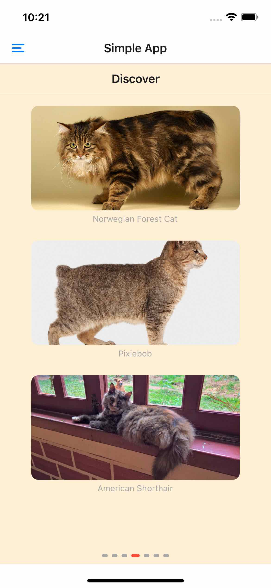
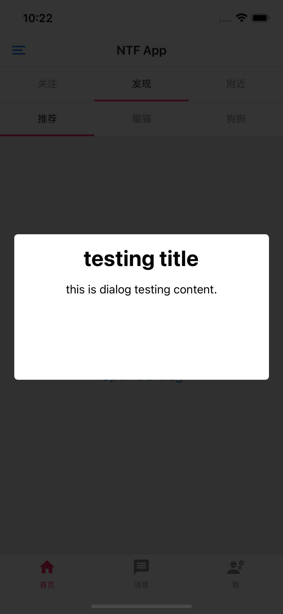

# 页面导航

<p>






</p>

尽管导航是开发 RN App 必不可少的工具之一，但官方框架并未将其内置，目前主流导航是 [React Navigation](https://reactnavigation.org/docs/getting-started/) 。

```shell
npm i @react-navigation/native 

# to use native stack navigator
npm i @react-navigation/native-stack
# dependencies
npm i react-native-screens react-native-safe-area-context

# stack navigator
npm install @react-navigation/stack

# bottom tab
npm install @react-navigation/bottom-tabs

# materials bottom tab
npm install @react-navigation/material-bottom-tabs react-native-paper react-native-vector-icons

# materials top tab
npm install @react-navigation/material-top-tabs react-native-tab-view

# drawer
npm install @react-navigation/drawer 
npm install react-native-gesture-handler react-native-reanimated
```

用好 React Navigator 的关键是，理解它的**两个配置项**和**导航路由对象**。

## 实现一个基础导航的三步

### 1. 创建“导航地图”

所谓的“导航地图”是指页面与页面间的连接。

从 @react-navigation/native 库中引入 `NavigationContainer` 容器组件，并将其放在最外层包裹住整个 App 的 JSX 元素。然后从 @react-navigation/native-stack 库中引入 `createNativeStackNavigator` 方法，并使用它来创建原生堆栈导航 (Native Stack Navigator) Stack 。

原生堆栈导航 是用来创建页面和收集该导航下有哪些页面的。创建页面用的是 `Stack.Screen` 组件，收集页面用的是 `Stack.Navigator` 组件。

完成页面的创建和页面的声明后，才算完成了“导航地图”。

### 2. 携带参数跳转页面

实现页面之间跳转，最常用的方法就是使用 `navigation.navigate` 。
函数组件只有通过 `Stack.Screen` 生成页面时，才会有 `navigation` 对象。如下，

```jsx
<Stack.Screen name="Detail" initialParams={obj} component={Detail} />
```

`navigation.navigate` 跳转页面的默认参数由 `initialParams` 指定的，也可传入携带参数，传入参数会与默认参数合并。还可以调用 `navigation.setParams` 设置参数。
（ initialParams 对象 和 params 对象 会进行**对象合并**，而不是覆盖 ）

```jsx
// 携带 Params
navigation.navigate('Detail', <T>obj);
// 不携带 Params，使用默认的 initialParams
navigation.navigate('Detail');

// 对象合并 
// 跳转时 params {price: 99.9 }
// 配置的 initialParams {symbol: '$'}
// 获取后：route.params {symbol: '$', price: 99.9 }

navigation.setParams({
  symbol: '￥',
  price: price * 6.3
})
```

无论是 `Stack.Screen` 还是 `Tab.Screen` ，这些“导航地图”中的 Screen 的 `component 属性`既接受<u>普通页面函数</u>作为参数，也可以接受<u>“导航地图”函数</u>作为参数。

如果“导航地图”的 Screen 接收“导航地图”作为 component 参数，就是实现导航嵌套的方法。

#### 导航配置 options

常用的配置项

- header 类：
   - title：它是字符串，用于设置导航标题；
   - headerBackTitleVisible：它是布尔值，用于决定返回按钮是否显示回退页面的名字。默认是 true 显示，大多数应用是不显示，因此最好设置为 false（iOS 专属）；
   - headerShown：它是布尔值，用于决定是否隐藏导航头部标题栏；header：它接收一个返回 React 元素的函数作为参数，返回的 React 元素就是新的导航标题栏。
- status 类：控制屏幕顶部状态栏用的，也可使用 React Native 框架提供的 <StatusBar /> 组件进行代替。
   - statusBarHidden：它是布尔值，它决定了屏幕顶部状态栏是否隐藏。

- 手势动画类：
   - gestureEnabled：它是布尔值，它决定了是否可用侧滑手势关闭当前页面（iOS 专属）；
   - fullScreenGestureEnabled：它是布尔值，它决定了是否使用全屏滑动手势关闭当前页面（iOS 专属）；
   - animation：它是字符串枚举值，它控制了打开或关闭 Stack 页面的动画形式，默认“default”是页面从右到左地推入动画，也可以设置成其他类型的动画，比如“slide_from_bottom”是页面从下到上的推入动画和从上到下的推出动画；
   - presentation：它是字符串枚举值，它控制了页面的展现形式，其主要作用是设置页面弹窗。常用的配置值是 “transparentModal”  它会将页面展示为一个透明弹窗。

```jsx
<Stack.Screen name="Detail" component={Detail} options={{
  headerShown: false,
  fullScreenGestureEnabled: true
}} />
```

重置 options 参数用的方法就是 `navigation.setOptions` 。
在初始化时，为了页面不抖动，必须使用同步的方法渲染页面。比如要隐藏头部和设置全局返回手势，
如果使用 React.useEffect() 异步副作用回调，执行 setOptions 会导致闪屏。

React 提供了同步执行的副作用函数 React.useLayoutEffect，把 navigation.setOptions 放在这里面执行，页面初始化的时候会同步地把头部隐藏起来，这样就不会出现页面抖动的现象了。

而异步设置 options 参数的场景，多用在有交互的场景，比如点击某个按钮，改变标题的文案。

```jsx
function Detail({ navigation}) {
  // 页面初始化时，同步设置
  React.useLayoutEffect(() => {
    navigation.setOptions({
      headerShown: false,
      fullScreenGestureEnabled: true,
    });
  }, [navigation])

  // 点击按钮后，异步设置
  const handlePress = () => {
    navigation.setOptions({
      title: '新标题',
    });
  }

  return (
    <Text onPress={handlePress}>设置新标题</Text>
  );
}
```

### 3. 页面接收和解析参数

在页面使用 `route.params` 接收参数

```jsx
import type {ParamListBase} from '@react-navigation/native';
import {NativeStackScreenProps} from '@react-navigation/native-stack';

interface DetailPageParams {
  title: string;
  image: string;
}
type NativeStackParamList = {
  ['Detail']: DetailPageParams;
};

// 接收参数
function Detail({
  route,
  navigation,
}: NativeStackScreenProps<NativeStackParamList, 'Detail'>) {
  const {title, image} = route.params;
}

// 不接收参数
function Detail({navigation}: NativeStackScreenProps<ParamListBase>) {
  // ...
}
```

## 各类导航

- [堆栈导航 - Stack Navigator](https://reactnavigation.org/docs/stack-navigator/)
- [抽屉导航 - Drawer Navigator](https://reactnavigation.org/docs/drawer-navigator/)
- [底部标签导航 - Bottom Tabs Navigator](https://reactnavigation.org/docs/bottom-tab-navigator)
- [Material Bottom Tabs Navigator](https://reactnavigation.org/docs/material-bottom-tab-navigator)
- [顶部标签导航 - Material Top Tabs Navigator](https://reactnavigation.org/docs/material-top-tab-navigator)

在 React Navigator 之中，最常用的导航是原生堆栈导航 Native Stack Navigator，使用它作为最外层的导航，来包裹其他的底部标签导航和顶部标签导航，实现常见 App 的多标签导航效果。


**比较导航下面两种导航的实现方式**

```
- App("导航地图")
  - TabHome("导航地图")
    - Home(标签页面)
    - Message (标签页面)
    - My(标签页面)
  - Page1(堆栈页面)
  - Page2(堆栈页面)
  - ...  (堆栈页面)
```

```
- App("Tab 导航地图")
  - Home("Stack 导航地图")
    - Page1
    - Page2
  - Message("Stack 导航地图")
    - Page3
    - Page4
```

## further more and reference

- install vector icons for [iOS](https://github.com/oblador/react-native-vector-icons#option-manually) and [Android](https://github.com/oblador/react-native-vector-icons#option-with-gradle-recommended)
- [Material Icons Search](https://fonts.google.com/icons?selected=Material+Icons)
