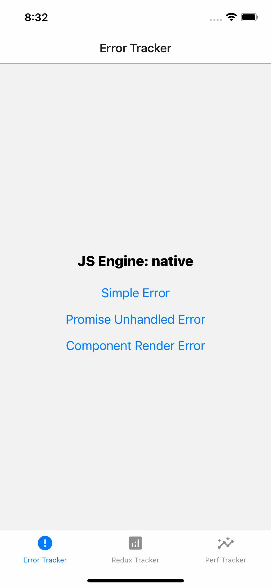
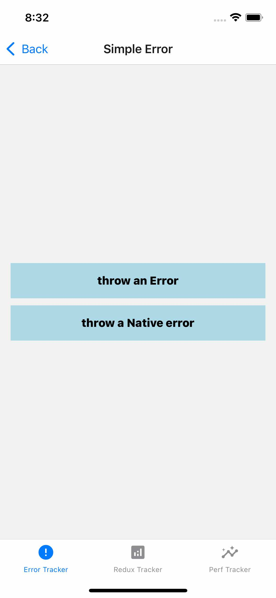
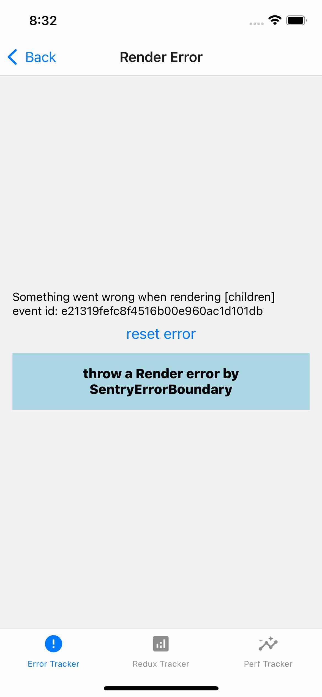
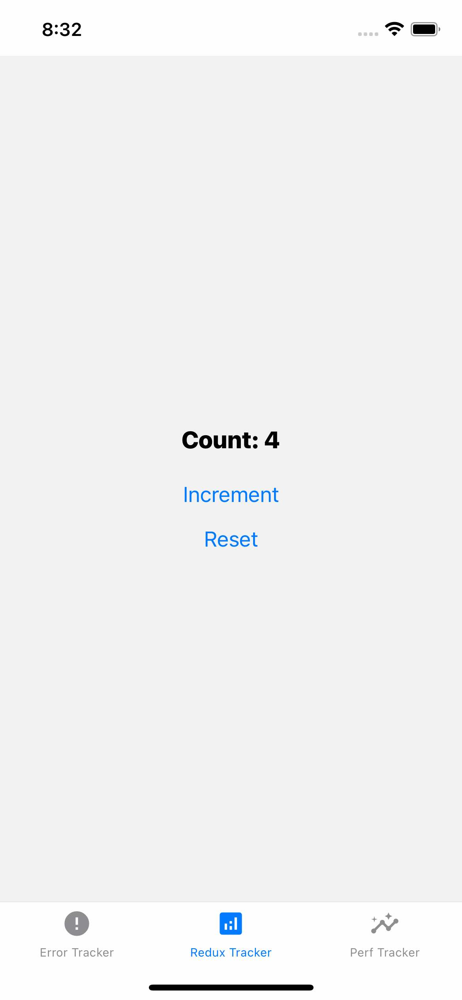
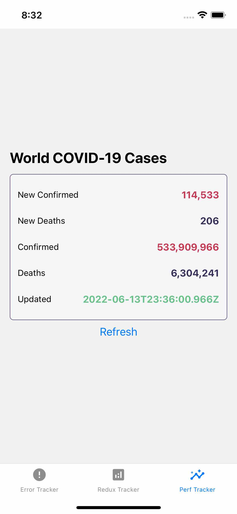

# Sentry

<p>





</p>

## 用户信息

报错信息的 用户 和 设备 信息

- 用户 ID 生成：`react-native-uuid` 生成 UUID 作为用户唯一标识；
- 存储用户 ID：`react-native-mmkv` 是持久化键值存储工具，性能比 AsyncStorage 更好；
- 设备信息：通过 `react-native-device-info` 来获取设备信息。

## 报错信息收集

### JS 未捕获错误

通过 ErrorUtils.setGlobalHandler 全局错误处理。

>[参考 RN 源代码](https://github.com/facebook/react-native/blob/main/Libraries/Core/setUpErrorHandling.js)

### Promise 未捕获错误

通过设置 PromiseRejectionTracker 的 PromiseRejectionTrackingOptions 来处理未捕获的 Promise 错误。相关源代码片段分析：

- 配置 PromiseRejectionTrackingOptions 对象：

   ```ts
   {
     allRejections: true,
     onUnhandled: (id: string, error: Error) => void,
     onHandled: (id: string) => void,
   }
   ```

- 开启 PromiseRejectionTracker：

   ```ts
   if (global?.HermesInternal?.hasPromise?.()) {
     const HermesPromise = global.Promise;
   
     if (__DEV__) {
       if (typeof HermesPromise !== 'function') {
         console.error('HermesPromise does not exist');
       }
       global.HermesInternal?.enablePromiseRejectionTracker?.(
         require('../promiseRejectionTrackingOptions').default,
       );
     }
   } else {
     if (__DEV__) {
       require('promise/setimmediate/rejection-tracking').enable(
         require('./promiseRejectionTrackingOptions').default,
       );
     }
   }
   ```

   - Hermes 引擎自有 enablePromiseRejectionTracker 方法来捕获未被 catch 的 Promise 错误；
   - 非 Hermes 引擎，则使用第三方 Promise 库中 rejection-tracking 提供的 enable 方法来捕获未被 catch 的 Promise 错误。

>[参考 RN 源代码1](https://github.com/facebook/react-native/blob/main/Libraries/Core/polyfillPromise.js)  
>[参考 RN 源代码2](https://github.com/facebook/react-native/blob/main/Libraries/promiseRejectionTrackingOptions.js)

### RN 组件的 render 错误

通过 ErrorBoundary 来实现。

组件 render 报错了，那么会触发 getDerivedStateFromError 回调，在 getDerivedStateFromError 回调中将控制是否有报错的开关状态 hasError 打开，并重新执行 render 渲染降级后的页面 (fallback UI)，同时还会触发 componentDidCatch 回调。可以在 componentDidCatch 回调中将组件的 render 错误上报。

>Note
>both getDerivedStateFromError() and componentDidCatch() are invoked after an error has been thrown by a descendant component.
>- getDerivedStateFromError() is called during the “render” phase, so side-effects are not permitted.
>- componentDidCatch() is called during the “commit” phase, so side-effects are permitted. 
>please refer to https://reactjs.org/docs/react-component.html#static-getderivedstatefromerror

ErrorBoundary 可以作为顶层组件，全局捕获所有子组件的 render 错误。也可以使用 ErrorBoundary 包裹局部组件，当某个局部组件出现错误时，使用 fallback UI 替换。

>[参考 sentry 源代码](https://github.com/getsentry/sentry-javascript/blob/master/packages/react/src/errorboundary.tsx)

### 手动上报

```ts
# 错误信息
Sentry.captureException(new Error('Oops!'))
Sentry.Native.captureException(new Error('Oops!'))
# 普通信息
Sentry.captureMessage('Test Message');

// with scope
Sentry.withScope(scope => {
  scope.setExtra('fireman', 'dao');
  errorInfo && scope.setExtras(errorInfo);
  Sentry.captureException(error);
});
```

**上报更多信息**

```ts
Sentry.setUser();

Sentry.setTag();
Sentry.setTags({});

Sentry.setExtra();
Sentry.setExtras({});

Sentry.setContext();

Sentry.addBreadcrumb();
```

>[参考 sentry-RN 示例代码](https://github.com/getsentry/sentry-react-native/blob/main/sample/src/screens/HomeScreen.tsx)

## 性能收集

Sentry 主要收集的性能包括：App 启动耗时；页面跳转耗时；请求耗时。


### App 启动耗时

Android 上就是 Fragment 所在的 Activity 启动完成后的 `onActivityCreated` 回调发生的时间点。
App 启动的结束时间点是在 React/React Native 应用的生命周期里，也就是组件挂载完成 componentDidMount 回调发生的时间点。

>参考 [onActivityCreated](https://github.com/getsentry/sentry-java/blob/main/sentry-android-core/src/main/java/io/sentry/android/core/ActivityLifecycleIntegration.java#L242)  
>参考 [componentDidMount @ReactNativeProfiler](https://github.com/getsentry/sentry-react-native/blob/main/src/js/tracing/reactnativeprofiler.tsx)

### 页面跳转耗时

如果使用的是 React Navigation，那在每次页面跳转之前都需要下达跳转命令，在下达跳转命令的时候会触发 `__unsafe_action__` 事件。因此，可以在 `__unsafe_action__` 事件的回调中添加页面跳转耗时的开始时间点。在页面跳转完成后，页面的状态会发生改变，此时会触发 state 改变事件，此时添加结束时间点。

示例代码

```ts
function App({navigation}) {
  useEffect(()=>{
    let startTime = 0
    navigation.addListener('__unsafe_action__', (e) => {
      startTime = Date.now()
    });

    navigation.addListener('state', (e) => {
      const totalTime = Date.now() - startTime
      console.log(`totalTime:${totalTime}`)
    });
  },[])

  return <></>
}
```

>参考 [ReactNavigationInstrumentation](https://github.com/getsentry/sentry-react-native/blob/main/src/js/tracing/reactnavigation.ts)

### 请求耗时

在 RN 中的 fetch 或 axios 请求都是基于 XMLHttpRequest 包装的。因此，统计请求耗时，就要监听 [XMLHttpRequest](https://developer.mozilla.org/zh-CN/docs/Web/API/XMLHttpRequest) 的 open 事件，以及其实例 xhr 的 onreadystatechange 事件。在 open 事件中，记录请求开始的时间点，在 onreadystatechange 事件触发时且 xhr.readyState === 4 时记录请求的结束时间点。

示例代码
```ts
let startTime = 0
const originalOpen = XMLHttpRequest.prototype.open

XMLHttpRequest.prototype.open(function(...args){
  startTime = Date.now()
  const xhr = this;
  const originalOnready = xhr.prototype.onreadystatechange

  xhr.prototype.onreadystatechange = function(...readyStateArgs) {
    if (xhr.readyState === 4) {
      const totalTime = Date.now() - startTime
      console.log(`totalTime:${totalTime}`)
    }
    originalOnready(...readyStateArgs)
  }

  originalOpen.apply(xhr, args)
})
```

>参考 [sentry/tracing request 源代码](https://github.com/getsentry/sentry-javascript/blob/master/packages/tracing/src/browser/request.ts)

## Instrumentation

### Automatic Instrumentation
- Wrap Your Root Component
- Enable Routing Instrumentation

### Manual Instrumentation

- withProfile
- transaction & span

```jsx
// create/get transaction
const transaction = Sentry.getCurrentHub()
  .getScope()
  .getTransaction();

const transaction = Sentry.startTransaction({ name: "test-transaction" });

// create Span and use it
const span = transaction.startChild({ op: "functionX" });// This function returns a Span
// functionCallX ...
span.finish(); // Remember that only finished spans will be sent with the transaction
transaction.finish(); // Finishing the transaction will send it to Sentry
```

也可以为整个 页面 Screen 创建一个 transaction

```tsx
const transaction = useRef<Transaction>();
useFocusEffect(
  useCallback(() => {
    transaction.current = startTransaction({
      name: 'manual-tracker',
      op: 'navigation',
    });

    return () => {
      transaction.current?.finish();
      configureScope(scope => {
        scope.setSpan(undefined);
      });
    };
  }, []),
);
```

## 注意点

- Minified Names in Production

When bundling for production, React Native will minify class and function names to reduce the bundle size. This means that you won't get the full original component names in your Profiler spans and instead you will see minified names.

A way to work around this is to set the displayName on all the components you want to track with touch events or to pass the name prop to the Profiler components.

The React Profiler currently generates spans with three different kinds of op-codes: ui.react.mount, ui.react.render, and ui.react.update.

```jsx
export default withProfiler(Detail, {name: 'Detail'});
```

>reference [this](https://docs.sentry.io/platforms/react-native/troubleshooting/#minified-names-in-production) and [this](https://docs.sentry.io/platforms/javascript/guides/react/components/profiler/)

## Reference & Further Reading

- [sentry 事件对象示例](sentry-event.json)
- [Automatic Instrumentation](https://docs.sentry.io/platforms/react-native/performance/instrumentation/automatic-instrumentation)
- [Redux Integration](https://docs.sentry.io/platforms/javascript/guides/react/configuration/integrations/redux/)
- [Error Boundaries](https://reactjs.org/docs/error-boundaries.html)
- 合理化 sentry 收集的数据量，参考 [Sampling](https://docs.sentry.io/platforms/react-native/configuration/sampling/) 和 [sentry Filtering](https://docs.sentry.io/platforms/react-native/configuration/filtering/)
- 调试信息，参考 [Source Maps](https://docs.sentry.io/platforms/react-native/sourcemaps/) 和 [Debug Symbols](https://docs.sentry.io/platforms/react-native/upload-debug/)
- [sentry for expo](https://github.com/expo/sentry-expo)
- [iPhone identifiers](https://github.com/SeparateRecords/apple_device_identifiers/blob/main/devices/iPhone.json)
